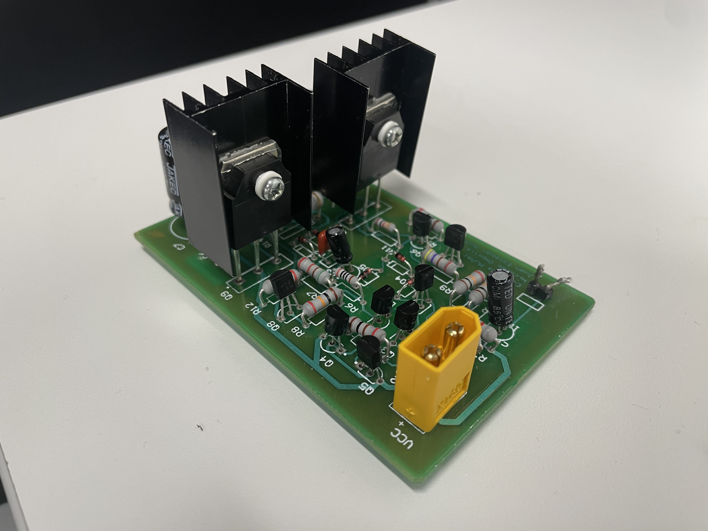
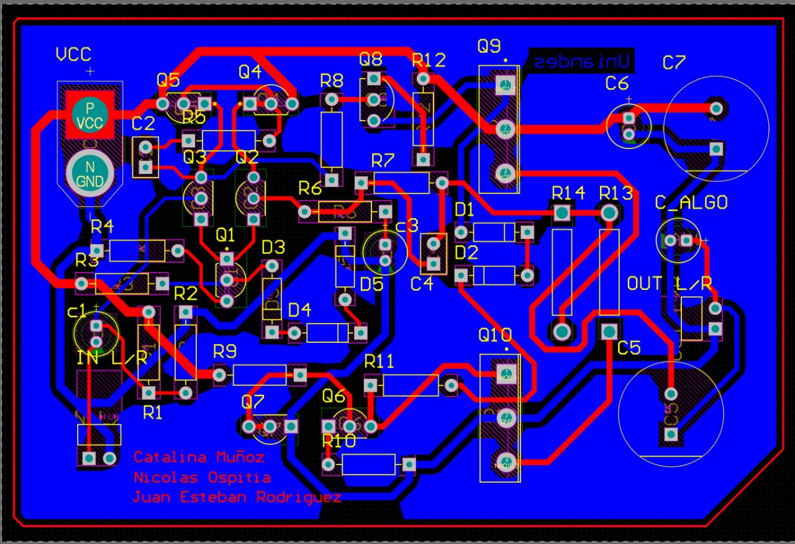

# Fully Analog Stereo Speaker System

A custom-built fully analog audio amplification system designed and assembled from discrete electronic components.

Unlike most modern audio projects, this system contains **no integrated circuits, no operational amplifiers, and no microcontrollers**. Every amplification stage was implemented using transistors, resistors, capacitors, diodes, and discrete components.

The project includes:

* Stereo Left / Right audio amplification
* Dedicated subwoofer amplification stage
* Custom designed PCB
* Analog low-frequency VU meter
* Audio-reactive LED indicators
* Custom LEGO enclosure

---

# Project Overview

The objective of this project was to design and build a complete audio system using only analog electronics principles.

The amplifier was developed from transistor-based amplification stages and assembled on a custom PCB designed specifically for the project.

Additional analog circuits were implemented to provide:

* Low-frequency visual feedback through a VU meter connected to the subwoofer channel
* Sound-level indication using LED arrays on each audio output
* Separate bass amplification for improved low-frequency performance

---

# Final Product

  

---

# PCB Design

  

---

# Schematic

The amplifier is implemented entirely with discrete electronic components including:

* Bipolar Junction Transistors (BJTs)
* Diodes
* Capacitors
* Resistors
* Passive filtering networks

A copy of the schematic is available in this repository.

---

# Features

## Stereo Amplification

Dedicated left and right audio channels.

## Bass Amplifier

Separate amplification stage for low-frequency reproduction.

## Analog VU Meter

Visual indication of bass activity using a low-frequency responsive LED meter.

## Audio-Reactive LEDs

Each audio channel includes a 4-LED indicator that lights up according to signal amplitude.

## Custom PCB

Designed specifically for the project and manufactured as a dedicated board.

## LEGO Enclosure

The final housing was built entirely from LEGO components.

---

# Demonstration Video

  

  Click the image above to watch the speaker in operation.

---

# Repository Structure

* README.md
* LICENSE
* schematic/
* pcb/
* photos/

---

# Authors

* Nicolás Ospitia

* Catalina Muñoz

* Juan Esteban Rodríguez

Universidad de los Andes
